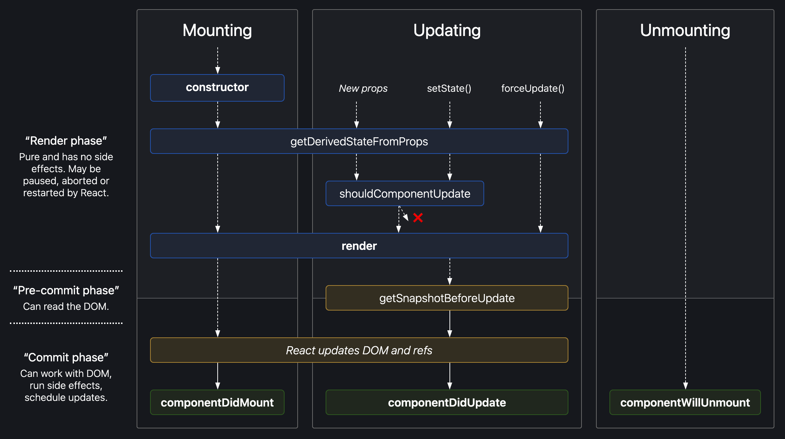

# Document Object Model (DOM)

DOM is a platform and language-neutral interface that allows programs and scripts to dynamically access and update the content, structure, and style of a document. 
So, while HTML is a text, the DOM is an in-memory representation of this text.

#### The HTML DOM provides an interface (API) to traverse and modify the nodes. It contains methods like `getElementById` or `removeChild`. We usually use JavaScript language to work with the DOM, because… Well, nobody knows why :).

- JavaScript can change all the HTML elements in the page
- JavaScript can change all the HTML attributes in the page
- JavaScript can change all the CSS styles in the page
- JavaScript can remove existing HTML elements and attributes
- JavaScript can add new HTML elements and attributes
- JavaScript can react to all existing HTML events in the page
- JavaScript can create new HTML events in the page for interaction must be used props,state and refs

#### When to Use Refs?
There are a few good use cases for refs:
Managing focus, text selection, or media playback.
Triggering imperative animations.
Integrating with third-party DOM libraries.
Avoid using refs for anything that can be done declaratively.
For example, instead of exposing `open()` and `close()` methods on a Dialog component, pass an `isOpen` prop to it.

#### NOTE: We will talk more about `refs` in another topic.


# Virtual DOM

First of all - the Virtual DOM was not invented by React, but React uses it and provides it for free.

#### The Virtual DOM is an abstraction of the HTML DOM. It is lightweight and detached from the browser-specific implementation details. Since the DOM itself was already an abstraction, the virtual DOM is, in fact, an abstraction of an abstraction.


- You can think of it as a copy of the DOM, that can be updated without affecting the actual DOM.
- It has all the same properties as the real DOM object, but doesn’t have the ability to write to the screen like the real DOM.
- The virtual DOM gains it’s speed and efficiency from the fact that it’s lightweight.
- In fact, a new virtual DOM is created after every re-render.


### Is the Shadow DOM the same as the Virtual DOM?
No, they are different. The Shadow DOM is a browser technology designed primarily for scoping variables and CSS in web components. The virtual DOM is a concept implemented by libraries in JavaScript on top of browser APIs.


## How does updates work in React?
- On the first load, ReactDOM.render() will create the Virtual DOM tree and real DOM tree.
- As React works on Observable patterns, when any event(like key press, left click, api response, etc.) occurred, Virtual DOM tree nodes are notified for props change, If the properties used in that node are updated, the node is updated else left as it is.
- React compares Virtual DOM with real DOM and updates real DOM. This process is called Reconciliation. React uses Diffing algorithm techniques of Reconciliation.
- Updated real DOM is repainted on browser.


## Additional points regarding updates.
- Virtual DOM is pure JS file and light weight, So capturing any update in Virtual DOM is much faster than directly updating on Real DOM.
- React takes a few milliseconds before reconciliation. This allows react to bundle few processes. This increases efficiency and avoids unnecessary reprocessing. Because of this delay we should not rely on this.state.val just after setState().
- React does shallow comparison of props value. We need to handle deep comparison separately, immutable is the most common way to handle it.


# ReactElement vs ReactComponent

### React Element

- React elements are the building blocks of React applications.
- React element is a light, stateless, virtual representation of a DOM Element.
- React elements are immutable.

```
const element = <h1>Hello, world</h1>;
```

#### ReactElements lives in the virtual DOM. They make the basic nodes here. Their immutability makes them easy and fast to compare and update. This is the reason of great React performance.

Once defined, ReactElements can be render into the “real” DOM. This is the moment when React ceases to control the elements. They become slow, boring DOM nodes:
```
var root = React.createElement('div');
ReactDOM.render(root, document.getElementById('example'));
```
JSX compiles HTML tags to ReactElements. So this is equivalent to the above:
```
var root = <div />;
ReactDOM.render(root, document.getElementById('example'));
```


### React Component

- React components are small, reusable pieces of code that return a React element to be rendered to the page.
- React components can have state - whenever the state changes, the component is rerendered.
- React components don’t have the access to the virtual DOM.
- React components have several “lifecycle methods” that you can override to run code at particular times in the process.

The simplest version of React component is a plain JavaScript function that returns a React element:
```
function Welcome(props) {
  return <h1>Hello, {props.name}</h1>;
}
```

Components can also be ES6 classes:
```
class Welcome extends React.Component {
  render() {
    return <h1>Hello, {this.props.name}</h1>;
  }
}
```

### The only method you must define in a React.Component subclass is called render().




Whenever a `ReactComponent` is changing the state, the `ReactComponent` is converted to the `ReactElement`. Now the `ReactElement` can be inserted to the virtual DOM, compared and updated fast and easily. How exactly - well, that’s the job of the diff algorithm.


## Reconciliation

React compares the Virtual DOM with Real DOM. It finds out the changed nodes and updates only the changed nodes in Real DOM leaving the rest nodes as it is. This process is called Reconciliation.

React implements a heuristic O(n) algorithm based on two assumptions:
- Two elements of different types will produce different trees.
- The developer can hint at which child elements may be stable across different renders with a key prop.

#### In practice, these assumptions are valid for almost all practical use cases.

- In the case, props of child components depend on updated state of the parent component, the Browser DOM will be updated the same as Virtual DOM. [Image Link](https://miro.medium.com/max/4800/1*XY6YFulg1MXfqkE0S0BBKA.png)
- In the case, props of child components DO NOT depend on updated state of the parent component, the Browser DOM will be updated differently with Virtual DOM. [Image Link](https://miro.medium.com/max/4800/1*BagS3xGxYxm1OYFsjRb5hA.png)


